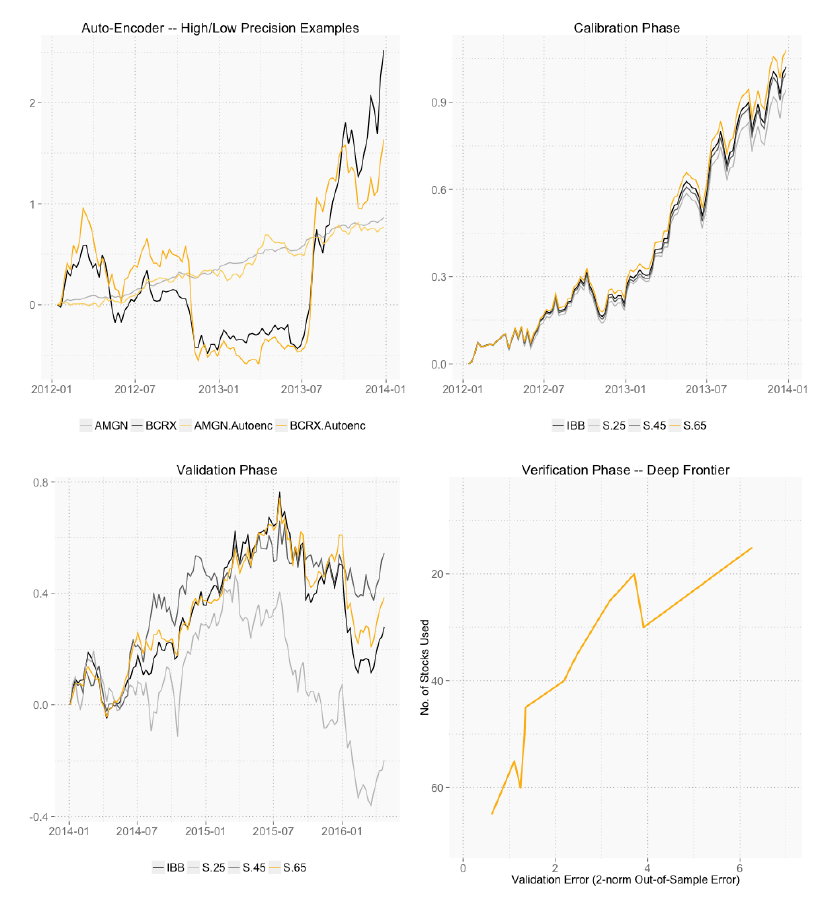
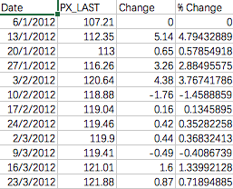
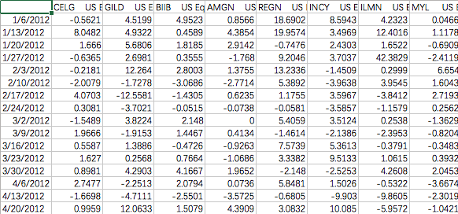

# About the paper: Deep Portfolio Theory and this repo

*Deep Portfolio Theory* is a portfolio selection method published by J. B. Heaton, N. G. Polson, J. H. Witte from GreyMaths Inc. 

Authors' codes are proprietary, so I (this github repo owner) can only try to code this notebook myself for experiment. I am not the author and is not related to the original authors. This code may not achieve satisfying results as the paper states. Maybe I misunderstand some parts from the paper, so I hope that someone can continue the research and contribute to the framework. (you are welcome to open issues.)

You may find relevant papers according to the lists:

- [Deep Portfolio Theory](https://arxiv.org/abs/1605.07230) (we will refer it as "the paper" in all following READMEs)
- [Deep Learning for Finance: Deep Portfolios](https://papers.ssrn.com/sol3/papers.cfm?abstract_id=2838013) (a more detailed version by the same authors)

## Some "tricky" stuffs you may want to know after reading the paper
- The authors use **"auto-encoding, calibration, validation and verification"** as machine learning steps. In computer science, we are more comfortable to call them **"auto-encoding, validation, testing and verification"**. But we will still follow the terms the authors use in this repo.

- For the graph below in Page 13, for convenience, let's name upper left, upper right, lower left, lower right as A, B, C, D.

	- For all A, B, C, I have no idea about the meaning of Y-axis. From my experiment, Y-axis shall represent the **last_price** of the stock/Index (so it should be values like 20, 50, 70 instead of 0, 1, 0.6, etc).
	- For A, **colors are not correct**: (TBC..)

## Tools

Python 3, Keras (Tensorflow Backend)

## Data

- Downloaded from Bloomberg Terminal

- Dates: from 2012/01/06 to 2016/04/29 (aligned with the paper)
	1. auto-encoder, calibration set: **2012/01/06 - 2013/12/27, 104 days** 
	2. validation, verification set: **2014/01/03 - 2016/04/29, 122 days** 

- As Section 2 of the paper states, stock data shall be treated as a matrix $X \in R^{T \times N}$, a market of $N$ stocks over $T$ time periods. You can consider it like: $T$ is number of data points (varied), $N$ is number of features (fixed).

- IBB Index Data (ibb_uq.csv)
    1. PX_LAST
    2. (absolute) Change
    3. % Change

- Component Stocks Data (percentage_change.csv)
    1. Some stock data are missing (not IPO yet, etc), so for data preprocessing, I ignore all the data without full record during 2012/01/06 to 2016/04/29.
    2. In this notebook I only use **percentage change** as input. I also prepare **net_change, last_price** in the repo if you are interested.

